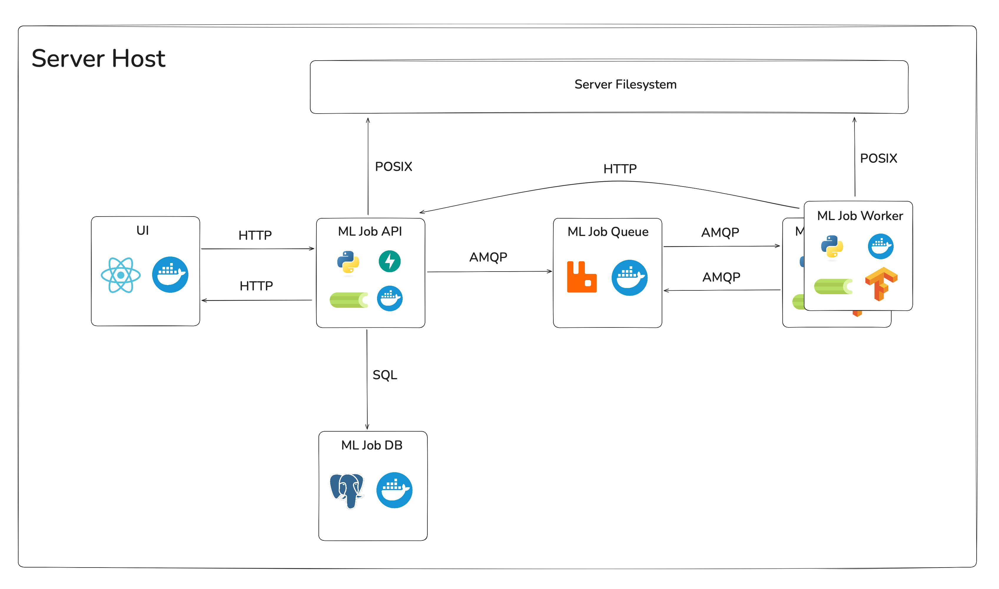

# 🤖 ML Job Manager

An **end-to-end scientific ML job orchestration platform** developed as part of my bachelor’s thesis and 
[Alisher Layik](https://github.com/sparki0)’s bachelor’s thesis in [CTU FIT (ČVUT FIT)](https://fit.cvut.cz/cs), 
designed to **ingest**, **preprocess**, **analyze**, and **manage large volumes of astronomical spectra** 
([LAMOST FITS files](https://dr2.lamost.org)) through human-in-the-loop machine learning workflows. 


The core goal of this system is to **streamline** and **automate** the full lifecycle of spectroscopic data processing, 
from raw file ingestion to active-learning–driven model refinement, while providing a unified API and web UI for monitoring, 
controlling, and labeling ML jobs.


In particular, this platform addresses the following needs and research objectives:


1. 💾 **High-Throughput FITS Ingestion & Preprocessing**

   - [LAMOST (Large Sky Area Multi-Object Fiber Spectroscopic Telescope)](https://www.lamost.org/public/?locale=en) 
   releases millions of raw `FITS` files containing stellar spectra. Before any classification or analysis can occur, 
   these spectra must be **read**, **normalized**, and  **interpolated onto a uniform wavelength grid**. The 
   **“Data Preprocessing”** pipeline in the system handles:
     - _Reading_ raw `FITS` headers and data arrays with **Astropy**.
     - _Interpolating_ flux values across a common wavelength range (e.g., 3800 Å to 9000 Å) with **Scikit-Learn**.
     - _Min–max scaling_ of flux measurements with **Scikit-Learn**.
     - _Writing_ the preprocessed spectra into a single, consolidated `HDF5` file for downstream tasks with **h5py**.


2. 💠 **Active Learning for Spectral Classification**

   - Even with large-scale labeled datasets, **manual labeling** of rare or ambiguous spectral classes remains 
   labor-intensive. The **“Active ML”** pipeline:
     - _Trains_ a 1D-CNN (built in **TensorFlow** & **Keras**) on any existing labeled spectra.
     - Uses uncertainty metrics (entropy of softmax outputs) to identify spectra that should be sent to an expert “oracle” 
     for manual labeling.
     - _Computes_ performance est. sets and candidate sets based on user-defined classes.
     - Iteratively _refines_ the training corpus by integrating newly labeled spectra, retraining, and selecting the next 
     batch for expert review.
     - _Outputs_ intermediate artifacts (`HDF5`, `JSON`) for visualization and for use by the frontend with **h5py**.


3. 👩🏼‍💻 **Human-in-the-Loop Labelling Workflow**

   - **To ensure high classification accuracy** on edge‐case spectra (e.g., double-peak emission lines), the system supports:
     - Automatic batch _initialization_ of labeling jobs (via an **HTTPX** callback to the back-end API).
     - A **React**-based web UI to _display_ selected spectra (with flux vs. wavelength plots) and collect “oracle” labels.
     - _Tracking_ of labeling status and iteration counts so that domain experts can focus on the spectra most beneficial 
     for model improvement.


4. 🖥️ **API & Web UI for Job Management**

   - Researcher user needs a **centralized way** to:
     - _Submit_ new data preprocessing or active-learning jobs (via REST endpoints) with **FastAPI** and **React**.
     - _Monitor_ job statuses, timestamps, and logs in real time.
     - _Browse_ raw and preprocessed spectra metadata, _view_ plots, and _download_ files  with **FastAPI**, **aiofiles**, 
     **Astropy**, and **Plotly**.


5. 🪛 **Scalable, Containerized DevOps Stack**

   - To simplify **deployment** and **reproducibility** across environments:
      - The entire platform is _containerized_ with **Docker**: **PostgreSQL** for metadata persistence, **RabbitMQ** 
     as the job message broker, **FastAPI** for backend, **Celery** workers for computations, and **React** for frontend.
      - A single `docker-compose.yml` file _spins up_ all services with a one-line command.
      - Environment‐driven configuration (via `.env` files and **Pydantic settings**) allows seamless _switching_ between 
     local development, testing, and production clusters.


By integrating these components, **ML Job Manager** provides a **robust research prototype and platform implementation** 
for anyone working on large‐scale astronomical spectroscopy, active learning in scientific contexts, or end-to-end ML 
workflow orchestration skeleton/basement for another scientific projects.

---

## 🗂️ Project Structure

Monorepo containing 3 components for an end-to-end ML job orchestration platform:

```
ml-job-manager/
├── images/           
├── ml-job-api/       ← ML Job API FastAPI microservice (REST API)
├── ml-job-ui/        ← ML Job UI React frontend (Web Interface + Spectra Visualizations)
├── ml-job-worker/    ← ML Job Worker Celery Worker (Data Preprocessing & Active ML)
├── docker-compose.yml
├── LICENSE           
└── README.md         
```



---

## 🚀 Features

- **ML Job API**:

  – CRUD endpoints for **jobs**, **labellings**, **spectra**, **file** storage.

  – Async `PostgreSQL` persistence, `Alembic` migrations.  

  – `Celery` integration for dispatching jobs.


- **ML Job Worker**:

  – `Celery` jobs: Data Preprocessing & Active ML pipelines.

  – `TensorFlow` CNN, `Scikit-Learn` utilities (SMOTE, t-SNE).

  – `HTTPX` callbacks to **ML Job API**.


- **ML Job UI**: 

  – `React` + `Tailwind` Web frontend. 

  – Live **job status**, **spectra view**, **labelling workflow**.


- **DevOps**:

  – `Docker` & `Docker Compose` for full-stack local development.

  – Environment-driven configuration via `.env` and Pydantic.

---

## 📦 Prerequisites

- `Docker` & `Docker Compose` ≥ v2.0. 

- Nvidia GPU for **ML Job Worker** `TensorFlow` CNN computations.

---

## 🔧 Quickstart

Clone the repo:

```bash
git clone https://github.com/bursasha/ml-job-manager.git
cd ml-job-manager
```

Create a `.env` in the project root (see `.env.example` for all keys):

```dotenv
DEBUG=True
FILES_DIR_PATH=...
SPECTRA_DIR_PATH=...
JOB_QUEUE=jobs

#

UI_PORT=10000

#

API_PORT=10100
ENGINE_CONNECTION_TIMEOUT=3

#

WORKER_PORT=10200
BROKER_CONNECTION_TIMEOUT=3
API_CONNECTION_TIMEOUT=3

#

POSTGRES_USER=...
POSTGRES_PASSWORD=...
POSTGRES_DB=...

#

RABBITMQ_MANAGEMENT_PORT=10300
RABBITMQ_DEFAULT_USER=...
RABBITMQ_DEFAULT_PASS=...
```

Bring up the entire stack:

```bash
docker compose up
```

This will launch following services:

- **ML Job UI** (`React`)

- **ML Job API** (`FastAPI`)

- **ML Job Worker** (`Celery`)

- **ML Job Queue** (`RabbitMQ`)

- **ML Job DB** (`PostgreSQL`)


You can now:

- Visit the UI at http://localhost:10000

- Browse API docs at http://localhost:10100/docs

---

## ⚙️ Stop & Remove Containers

Stop:

```bash
docker compose stop
```

Remove: 

```bash
docker compose down
```

---

## 📈 View Logs

```bash
docker compose logs -f ml-job-ui
docker compose logs -f ml-job-api
docker compose logs -f ml-job-worker
docker compose logs -f ml-job-queue
docker compose logs -f ml-job-db
```

---

## 📄 License

This work is made available under the terms of a non‐exclusive authorization per Act No. 121/2000 Coll., Copyright Act, 
and Section 2373(2) of Act No. 89/2012 Coll., Civil Code (see [ML Job Manager LICENSE](./LICENSE) for full text).
